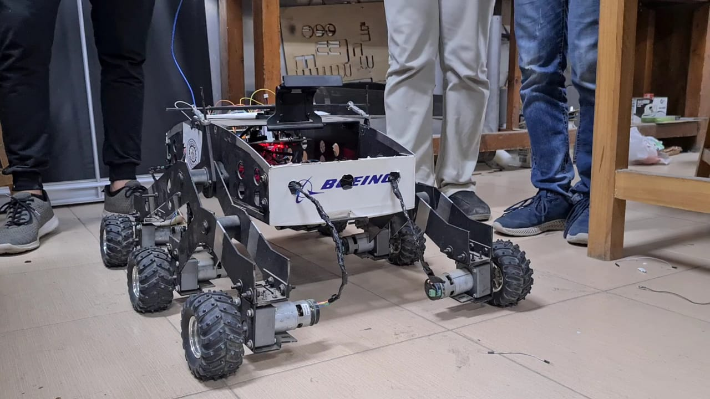

</img>
To start off, if you're here to buy our project for less than $10M then save both of our time for now and come again whenever your $10M is ready. 

<h3> This is Mars <h3>
</img>
 <h3> This is the CMP Rover </h3>
</img>
   

This engineering masterpiece is a school project that serves as a partial fulfillment of the Requirements of the Microprocessors' course that's taught to Computer Engineering Sophomores (2020-2021) at Cairo Uiversity.  <h4>
 🛰️ The Rover's mechanical body complies with NASA's standards.  
 ✨ This is essentialy a discovery robot that is also tailored for rescue operations.     </h4>
 As for what it can do: 
 
<h2 align="center"> ⚙️ Overcome Obstacles ⚙️ </h2>
</img>
<h2 align="center"> ♟️ Carry Samples ♟️ </h2>
</img>
<h2 align="center">🎮 Be Controlled Remotely 🎮 </h2>
</img>
<h2 align="center"> 🚨 Sense the Environment 🚨 </h2>
</img>
<h2 align="center"> 📱 In fact it comes with its own mobile app 📱 </h2>
</img>
<h2 align="center"> ⚓ Can Protect up to 4 People ⚓ </h2>
</img>
<h2 align="center"> 🚘 And Park with Style 🚘 </h2>
</img>
<h2 align="center"> 🤖 Object Detection 🤖 </h2>
</img>
And that's not even everything, this knockout creates a map of the surrounding environment as it manuevers around!
<h2 align="center"> 🌌 This of course required so much hardwork :)) 🌌 </h2>
</img>

Check <a href="https://drive.google.com/file/d/1_2vY5mpbSkfSax8JPcR11N66aZeaIF92/view">this</a> and <a href="https://drive.google.com/file/d/1k2w_OZLcA2brSdettXkSTQvQLXGtJIx3/view?usp=sharing">this</a> for videos and check <a href="https://www.youtube.com/channel/UC8LjTOiv0VsRGknhslmeZFA/playlists">this</a> for the underlying team structure.

<h2 align="center"> 💖 Thank you. 💖 </h2>
